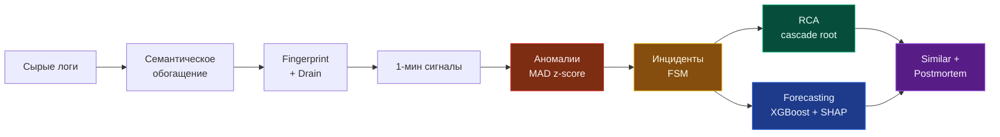
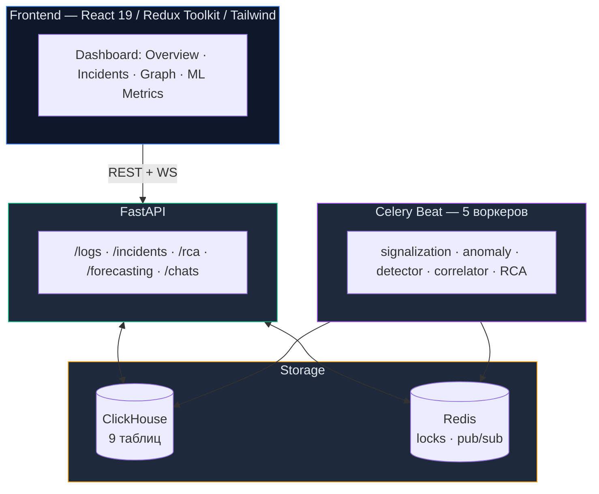

# AutoLogExplain

> **Полуавтоматическая SRE-платформа для интерпретации логов:** превращает поток сырых логов в структурированные инциденты с объяснимой первопричиной и прогнозом риска на ближайшие 15 минут.

## Pipeline



## Архитектура



**Стек:** Python 3.11, FastAPI, Celery, ClickHouse, Redis, XGBoost, SHAP, React 19, Redux Toolkit, RTK Query, Tailwind CSS, Vite.

FSM инцидента: `open → acknowledged → mitigated → resolved` + `resolved → reopened`. История изменений — append-only в `incident_events`.

## Требования

- Docker 24.0+ и Docker Compose 2.20+ для backend-стека.
- Python 3.11 для вспомогательных E2E-скриптов.
- Node.js `20.19+` либо `22.12+` для frontend. Node.js 12/16/18 не подходит для Vite 7 и Tailwind 4.

## Quick Start

```bash
# 0. Если используете nvm
nvm install
nvm use

# 1. Конфигурация
cp backend/.env.example backend/.env
cp analytics/.env.example analytics/.env  # только если нужен LLM-чат

# 2. Backend stack
(cd backend && docker compose up -d --build)

# 3. Демо-данные + полный pipeline
bash e2e-artifacts/full_pipeline.sh

# 4. Frontend
(cd frontend && npm install && npm run dev)
```

После старта:
- API + Swagger: <http://localhost:8080/docs>
- Frontend: <http://localhost:5173>

Чтобы заработал блок прогноза, надо обучить XGBoost-модель:

```bash
python3 e2e-artifacts/generate_training_dataset.py
docker compose exec api python -m backend.services.forecasting.trainer
```

## Подсистемы

| Слой | Модуль | Кратко |
|---|---|---|
| Семантика | [log_tags.py](backend/services/log_tags.py) | Rule-based категоризация (database / network / auth / …) и нормализация severity |
| Семантика | [log_fingerprints.py](backend/services/log_fingerprints.py) | Нормализация template (числа, UUID, IP, hex → плейсхолдеры) + SHA-1 fingerprint |
| Семантика | [log_clustering.py](backend/services/log_clustering.py) | Drain-кластеризация (He et al., 2017): дерево + similarity ≥ 0.5 |
| Сигналы | [signals/](backend/services/signals/) | 1-минутные агрегаты + два типа аномалий: `volume_spike` и `new_fingerprint_burst` |
| Аномалии | [anomaly_detector.py](backend/services/anomaly_detector.py) | MAD z-score `0.6745·|x − median| / MAD`, порог 3.5 — робастен к выбросам |
| SLO | [slo_tracker.py](backend/services/slo_tracker.py) | Multi-window burn rate (Google SRE): окна `1h / 6h / 24h`, пороги 14.4× / 6× / 3× |
| Инциденты | [incidents/](backend/services/incidents/) | 3-cycle pipeline `detect → correlate → RCA` с distributed lock на Redis |
| Граф | [dependency_graph.py](backend/services/dependency_graph.py) | Граф из `trace_id` (≥ 3 встреч); ни одна связь не введена вручную |
| RCA | [rca_engine.py](backend/services/rca_engine.py) | Объяснимая формула + confidence по 4 проверкам |
| Прогноз | [forecasting/](backend/services/forecasting/) | XGBoost + SHAP: «начнётся ли инцидент в ближайшие 15 минут?» (32 признака) |
| Recovery | [similar_incidents/](backend/services/similar_incidents/) | Hybrid score: Jaccard + cosine + exact-match, без vector DB |
| Recovery | [postmortem/](backend/services/postmortem/) | Детерминированный markdown-генератор без LLM (исключает hallucinations) |
| LLM | [analytics/](analytics/), [llm_service.py](backend/services/llm_service.py) | Чат с YandexGPT (требует `YC_FOLDER_ID` + `YC_API_KEY`) |

### RCA-формула

```
rca_score = 0.35·anomaly + 0.25·earliness + 0.20·fanout + 0.20·criticality
```

- **anomaly** — нормализованный z-score кандидата
- **earliness** — насколько рано в каскаде он появился
- **fanout** — сколько downstream-сервисов за ним пострадали
- **criticality** — текущее SLO-состояние

`confidence` = доля 4 проверок (есть аномалия / есть граф / реконструирован каскад / сожжено SLO). Все четыре → 100%.

## API

Полная спецификация в Swagger (`/docs`). Ключевое:

| Path | Description |
|---|---|
| `GET /logs/list`, `/logs/categories`, `/logs/tree` | Логи + агрегаты по категориям |
| `GET /incidents`, `/incidents/{id}` | Список и карточка инцидента |
| `PATCH /incidents/{id}/status` | FSM-переход |
| `GET /incidents/{id}/{timeline,evidence,similar,postmortem}` | Артефакты карточки |
| `POST /rca/analyze/{fp}` | On-demand RCA для fingerprint |
| `GET /rca/{graph,templates,slo,reports,metrics}` | Граф · шаблоны · SLO · сохранённые отчёты · сравнение детекторов |
| `GET /forecasting/info`, `/forecasting/risk?hours=2` | Метаданные модели + risk + SHAP top-features |
| `POST /chats/new` + `WS /ws/chats/{chat_id}` | LLM-чат |

## Таблицы ClickHouse

| Table | Purpose |
|---|---|
| `logs` | Сырые логи |
| `log_signals_1m` | 1-минутные агрегаты по `(service, env, category, severity, fingerprint)` |
| `fingerprint_catalog` | Каталог уникальных шаблонов |
| `anomaly_events` | Зафиксированные MAD-аномалии |
| `incident_candidates`, `incidents`, `incident_events` | Pipeline → versioned snapshots → audit trail |
| `slo_burn` | Burn rate по окнам `1h / 6h / 24h` |
| `service_dependency_graph` | Граф зависимостей сервисов |

Все служебные таблицы создаются автоматически при старте backend.

## Конфигурация

| Variable | Default | Notes |
|---|---|---|
| `CLICKHOUSE_HOST` | `clickhouse` | backend storage |
| `REDIS_HOST` | `redis` | broker / pub-sub / locks |
| `TOKEN_SECRET` | required | секрет для chat JWT |
| `INCIDENT_ANOMALY_THRESHOLD` | `3.5` | порог MAD detector |
| `INCIDENT_CORRELATION_WINDOW_MINUTES` | `30` | окно merge кандидатов |
| `YC_API_KEY`, `YC_FOLDER_ID` | none | YandexGPT (`analytics/.env`) |

Полные примеры: [backend/.env.example](backend/.env.example), [analytics/.env.example](analytics/.env.example), [backend/core/config.py](backend/core/config.py).

## Тестирование

```bash
# Backend (204 unit-теста)
docker compose exec api python -m pytest backend/tests/unit -v

# Offline-сравнение детекторов
docker compose exec api python /app/e2e-artifacts/evaluate_detectors.py

# Frontend
cd frontend && npx tsc --noEmit -p tsconfig.app.json && npm test && npm run build
```
